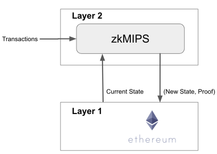

# Use Cases

## Ethereum Layer 2 Rollup

ZKM has valuable applications in Layer 2 (L2) blockchain solutions. L2 solutions aim to alleviate the scalability limitations of the underlying Layer 1 blockchain by processing transactions off-chain. Using ZKM, participants can cryptographically prove the validity of off-chain transactions in the Ethereum blockchain without revealing the specific details of each transaction on the public blockchain. This ensures the integrity of transactions.

<figure><figcaption></figcaption></figure>

In addition, multiple transactions can be aggregated into a single proof, reducing the computational overhead required for verification and enhancing scalability. The provided proof guarantees the correctness of the transaction execution and hence reduces the withdrawal time of the processed fund.

## IoT Devices

ZKM, utilizing the MIPS instruction set, holds promises to add verifiable commuting functionalities to IoT, VR, and wearable devices that incorporate MIPS processors. In the realm of IoT, ZKM can offer secure and privacy-preserving communication protocols for connected devices. By leveraging ZKP, ZKM can enable secure data exchange, authentication, and integrity verification within IoT networks. This ensures that sensitive information remains confidential and protected against unauthorized access.&#x20;

<figure><figcaption></figcaption></figure>

In the context of Virtual Reality (VR), ZKM can contribute to improved privacy and security in VR environments. ZKM can enable users to interact and engage in virtual experiences while maintaining the confidentiality of their personal data and activities. This includes safeguarding sensitive user information, such as biometric data or behavioral patterns, from potential threats. One such application can be explained through VR concerts that are rising in popularity. In one such example, a concert organizer may want to issue tickets in the form of non-fungible tokens (NFTs) to concert givers, but to avoid keeping data due to General Data Protection Regulation (GDPR) and other information laws, they can utilize this feature in order to register concert attendees through the public addresses of these NFTs - due to power of zero-knowledge, the organizer only needs the proof that a ticket has been paid for by a certain address, while the attendee can enjoy the concert live, without worrying about whether their data are being tracked.&#x20;

Furthermore, in wearable devices that utilize MIPS architecture, ZKM can offer privacy-enhancing features and provide secure and private interactions with connected devices and networks. This can be particularly crucial for wearables that handle sensitive user data, such as health-related information or personal fitness metrics.

## Cloud Computing

<figure><figcaption></figcaption></figure>

ZKM introduces an exciting opportunity for decentralized cloud computing systems. With ZKM, the computations can be offload to the cloud, leveraging the power of thousands of untrusted processors to execute them swiftly. Despite the untrusted nature of these processors, the computation result can still be trusted when using ZKM. This breakthrough paves the way for innovative applications in secure and scalable cloud computing.

## zkML

In the machine learning (ML) world, the use of ZKP has the potential to verify the application of a given ML model or hide the user’s valuable data. This is referred to as zero-knowledge machine learning (zkML). Since the weight values within an ML model are considered proprietary information held by service providers, clients should have the means to verify the correctness of the results without accessing the trained model. Moreover, when a third party examines the results, it should be possible to confirm their accuracy even without the user’s input data. The figure below shows a scenario in medical systems where a patient sends their ECG to an ML Service Provider, and the processed result is sent back to their physician. As depicted, the physician requires a means to verify the correctness of the process.

<figure><figcaption></figcaption></figure>

The utilization of ZKM can be expanded across various applications and scenarios. Consequently, it has become crucial for users to take advantage of ML computations without revealing the input values in order to preserve users’ privacy.
